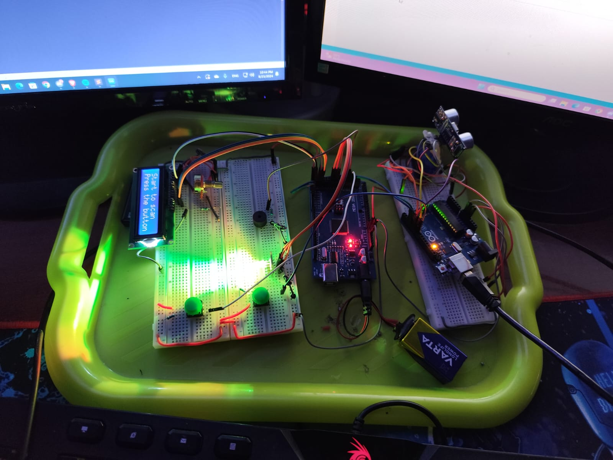
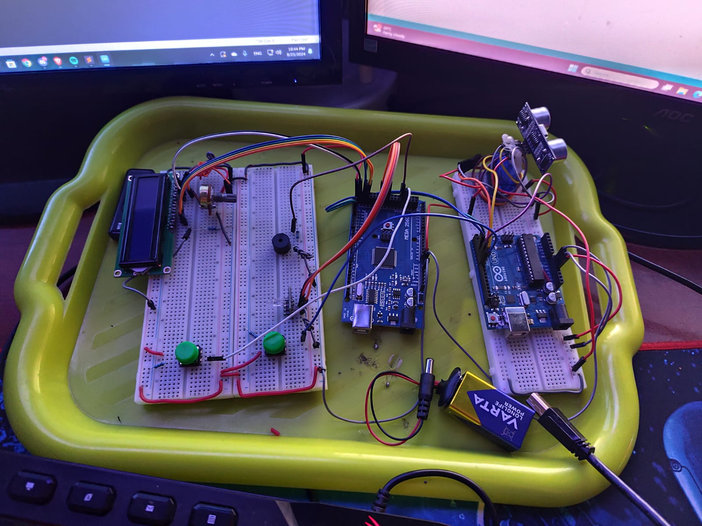

# Motion Detection and Alarm System with Servo and Ultrasonic Sensor

This project uses a servo motor and ultrasonic sensor to continuously scan surroundings. It detects movement by measuring distance changes and triggers an alarm with a buzzer if significant variations are found. Includes RGB LED for visual alerts. It can be used as a motion alarm. An example of how it works cand be found at (`Video.mp4`)

## Table of Contents
- [Components Used](#components-used)
- [Circuit Diagram](#circuit-diagram)
- [Schematic View](#schematic-view)
- [Installation](#installation)
- [Usage](#usage)
- [Code Structure](#code-structure)
  - [Arduino UNO](#arduino-uno)
    - [Button Class](#button-class)
    - [ServoMotor Class](#servomotor-class)
    - [Ultrasonic Sensor Class](#ultrasonic-sensor-class)
    - [Command Processing](#command-processing)
  - [Arduino MEGA](#arduino-mega)
    - [Compare Arrays](#compare-arrays)
  - [Communication Between the Two Arduinos](#communication-between-the-two-arduinos)
- [License](#license)
- [Credits](#credits)
- [Physical Project Image](#physical-project-image)

## Components Used
- 1x Arduino UNO
- 1x Arduino MEGA
- 1x Servo SG90 9g
- 1x HC-SR04
- 1x Buzzer
- 2x 220 Ω Resistor
- 2x 1k Ω Resistor
- 1x 10k Ω Potentiometer
- 1x RGB Module (common cathode)
- 2x Button
- 1x 9V battery
- 1x 9V battery conector
- 4x Male-to-female jumper wires
- ???x Male-tomale jumper wires

## Circuit Diagram

## Schematic View

## Installation
1. **Connect the Arduino components**: Assemble the circuit as per the provided circuit diagram.
2. **Upload Arduino UNO Code**: Use the Arduino IDE or other suitable software to upload the provided Arduino code ('UnoTransmitter/UnoTransmitter.ino') to your Arduino UNO board.
3. **Upload Arduino MEGA Code**: Use the Arduino IDE or other suitable software to upload the provided Arduino code ('MegaReciever/MegaReciever.ino') to your Arduino MEGA board.
4. **Connect the power supplies**: Connect USB-B cable to Arduino UNO and the 9V battery to Arduno MEGA to ensure it has enough power.

## Usage
1. **Choose the area you want to scan**: Position the assembly so that the sensor scans the desired area.
2. **Do the reference scan**: Press on button_start_scan to get the reference scan, the values will be compared with this one. 
For precision the reference scan will be a double scan and the average values between those 2 scans will be used for comparation.
3. **Wait until the alarm goes off**: There will be 2 scans before the values gets compared (1 scan = 0°->180°->0°), you can check the scan number on the LED.
4. **Stop the alarm**: When the alarm starts you can stop it by pressing button_stop_alarm

## Code Structure

### Arduino UNO 

#### Button Class

- **`int getPinVal()`**: This method returns the current state of the button, indicating whether it is pressed or not.

#### ServoMotor Class

- **`void rotateCycle(int step, int timeP, int &poz)`**: Rotates the servo motor by a specified step size, with each step occurring after a given time period.
- **`void setDefault()`**: Resets the servo motor to its default position at 0 degrees.

#### Ultrasonic Sensor Class

- **`int getDistance()`**: Sends an ultrasonic pulse and calculates the distance to an object based on the time it takes for the echo to return.

#### Command Processing

The Arduino UNO in this project can process three main commands to control the servo motor:

1. **`SET_SERVO <step> <time>`**: Configures the servo motor to rotate with the specified step size and time interval between steps.
2. **`STOP_SERVO`**: Stops the servo motor by setting the time interval to 500 milliseconds and the step size to 0.
3. **`SET_SERVO_DEFAULT`**: Sets the servo motor to a default configuration with a 15-step size and a 75-millisecond time interval between steps.

**Note:** The step size and time interval are saved to EEPROM memory to preserve these settings even if the Arduino loses power. The EEPROM addresses used are:
- **Step size**: Stored at address `0x00`
- **Time interval**: Stored at address `0x04`
- **Video demonstration** at (`Command_Usage.mp4`) 

### Arduino MEGA
#### Compare arrays
The `compareArrays` function compares two arrays against a reference scan (`firstScanArr`). It takes three arrays as input:

- `firstScanArr`: The reference array.
- `firstDistancesArr` and `secondDistancesArr`: The subsequent scan arrays to be compared.

The function calculates the average of each corresponding element from the two subsequent scans and checks if this average falls within 75%-125% of the value at the same position in the reference array. This method ensures that the average of the subsequent scans remains within a permissible range of the reference scan.

The function returns the percentage of elements in the subsequent scans that meet this criterion, providing a measure of accuracy relative to the reference scan.

### Communication Between the Two Arduinos

The communication between the Arduino UNO and Arduino MEGA is done using the UART communication protocol, with a baud rate of 19200. 

- **Arduino MEGA**: Uses RX1 for receiving data and TX1 for transmitting data.
- **Arduino UNO**: Uses digital pin 3 as RX and digital pin 4 as TX for UART communication.

The Arduino UNO is responsible for reading and processing data from the HR-SC04 ultrasonic sensor into an array. The message format is: S:newScan(0/1):arrayLength=value1,value2,...,valueN\n

This message is sent via `SerialUART.write` in 48-byte chunks.

On the Arduino MEGA, the message is received and parsed into smaller segments. 

- If `newScan` is `1`, the data is treated as a reference scan (the baseline for comparison).
- If `newScan` is `0`, the data values are loaded into one of the other arrays for further processing and comparison.

## License
This project is licensed under the [MIT License](LICENSE).

## Credits
- **Author**: Felix-Marian STOENOIU
- **Email**: Stoenoiu.Felix1@gmail.com
- **GitHub**: [My GitHub profile](https://github.com/FelixMarian)

## Physical Project Image

